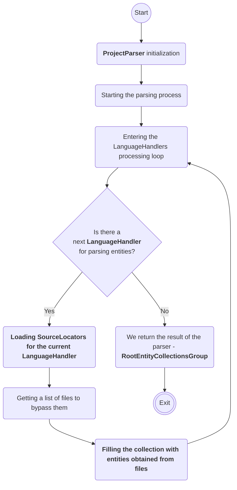

[BumbleDocGen](/docs/README.md) **/**
[Technical description of the project](/docs/tech/readme.md) **/**
Parser

---


# Documentation parser

Most often, we need [ProjectParser](/docs/tech/02_parser/classes/ProjectParser.md) in order to get a list of entities for documentation.
But this is not the only use of this tool. The result of the parser's work (a collection of entities) can be used to programmatically analyze the project and perform any operations based on this analysis.
For example, in our documentation generator, we also use the result of the parser in the tasks of generating documentation using AI tools.
You can also use the parser for your own purposes other than generating documentation.

In this section, we show how the parser works and what components it consists of.

## Description of the main components of the parser


- [Entities and entities collections](/docs/tech/02_parser/entity.md)
- [Entity filter conditions](/docs/tech/02_parser/entityFilterCondition.md)
- [Reflection API](/docs/tech/02_parser/reflectionApi/readme.md)    
    - [Reflection API for PHP](/docs/tech/02_parser/reflectionApi/php/readme.md)    
        - [PHP class constant reflection API](/docs/tech/02_parser/reflectionApi/php/phpClassConstantReflectionApi.md)
        - [PHP class method reflection API](/docs/tech/02_parser/reflectionApi/php/phpClassMethodReflectionApi.md)
        - [PHP class property reflection API](/docs/tech/02_parser/reflectionApi/php/phpClassPropertyReflectionApi.md)
        - [PHP class reflection API](/docs/tech/02_parser/reflectionApi/php/phpClassReflectionApi.md)
        - [PHP entities collection](/docs/tech/02_parser/reflectionApi/php/phpEntitiesCollection.md)
        - [PHP enum reflection API](/docs/tech/02_parser/reflectionApi/php/phpEnumReflectionApi.md)
        - [PHP interface reflection API](/docs/tech/02_parser/reflectionApi/php/phpInterfaceReflectionApi.md)
        - [PHP trait reflection API](/docs/tech/02_parser/reflectionApi/php/phpTraitReflectionApi.md)
- [Source locators](/docs/tech/02_parser/sourceLocator.md)

## Starting the parsing process

```php
$parser = new ProjectParser($configuration, $rootEntityCollectionsGroup);

// Parsing the project and filling RootEntityCollectionsGroup with data
$this->parser->parse();
$rootEntityCollectionsGroup = $this->parser->getRootEntityCollectionsGroup();
```

## How it works



---

**Last page committer:** fshcherbanich &lt;filipp.shcherbanich@team.bumble.com&gt;<br>**Last modified date:**   Thu Jan 18 14:38:29 2024 +0300<br>**Page content update date:** Thu Jan 18 2024<br>Made with [Bumble Documentation Generator](https://github.com/bumble-tech/bumble-doc-gen/blob/master/docs/README.md)