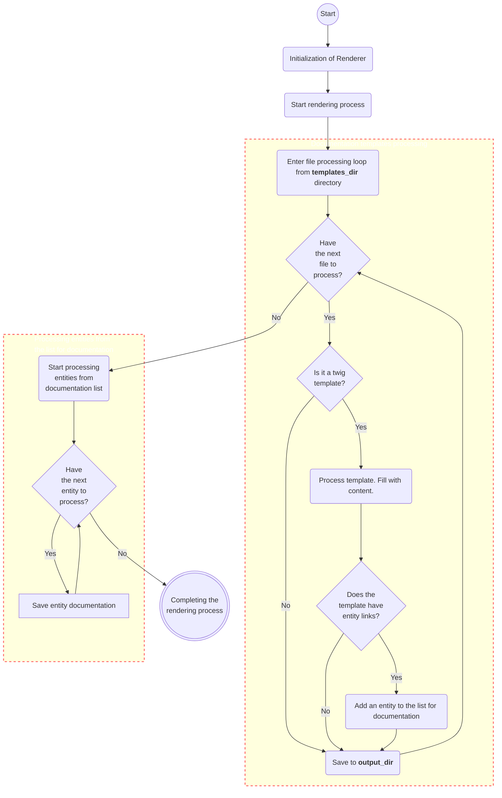

[BumbleDocGen](../../README.md) **/**
[Technical description of the project](../readme.md) **/**
Renderer

---


# Documentation renderer

Render passes through all files from the directory specified in configuration param `templates_dir`

If the file ends with **.twig** then the file is processed, otherwise it is simply copied
to the target directory obtained from configuration param `output_dir`.
We use twig to process templates.

## More detailed description of renderer components


- [How to create documentation templates?](01_howToCreateTemplates/readme.md)    
    - [Front Matter](01_howToCreateTemplates/frontMatter.md)
    - [Templates dynamic blocks](01_howToCreateTemplates/templatesDynamicBlocks.md)
    - [Linking templates](01_howToCreateTemplates/templatesLinking.md)
    - [Templates variables](01_howToCreateTemplates/templatesVariables.md)
- [Documentation structure and breadcrumbs](02_breadcrumbs.md)
- [Document structure of generated entities](03_documentStructure.md)
- [Template filters](04_twigCustomFilters.md)
- [Template functions](05_twigCustomFunctions.md)

## Starting the rendering process

```php
$renderer = new Renderer(...);

// Starting the process of filling templates with data and saving finished documents
$renderer->run();
```

## How it works

The process of rendering documents is divided into several stages. We separately generate documentation for templates that were pre-prepared by the user,
and then create documentation for classes that the user refers to from document templates.
This process is presented in the form of a diagram below.



---

**Last page committer:** fshcherbanich &lt;filipp.shcherbanich@team.bumble.com&gt;<br>**Last modified date:**   Sat Jan 20 00:42:48 2024 +0300<br>**Page content update date:** Fri Jan 19 2024<br>Made with [Bumble Documentation Generator](https://github.com/bumble-tech/bumble-doc-gen/blob/master/docs/README.md)