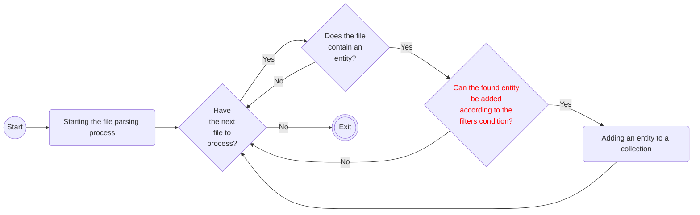

<embed> <a href="/docs/README.md">BumbleDocGen</a> <b>/</b> <a href="/docs/tech/readme.md">Technical description of the project</a> <b>/</b> <a href="/docs/tech/2.parser/readme.md">Parser</a> <b>/</b> Entity filter conditions<hr> </embed>

<embed> <h1>Entity filter conditions</h1> </embed>

Filters serve as a foundational mechanism within our documentation generator, dictating which segments of the source code are selected during the initial parsing phase.
These rules facilitate a strategic extraction of elements, such as classes, methods, or constants, from the underlying codebase.
By implementing these filters, users are endowed with the capability to customize the documentation output, ensuring that it precisely aligns with their requirements and expectations.
This level of granularity not only streamlines the documentation process but also guarantees that the resultant documents are devoid of superfluous details, focusing solely on pertinent information.

All filter conditions implement the <a href="/docs/tech/2.parser/classes/ConditionInterface.md">ConditionInterface</a> interface.

<embed> <h2>Mechanism for adding entities to the collection</h2> </embed>

For each language handler, according to the configuration, the following scheme is applicable:



The diagram shows the mechanism for adding root entities, but this also applies to the attributes of each entity,
for example, for PHP there are rules for checking the possibility of adding methods, properties and constants.

<embed> <h2>Filter conditions configuration</h2> </embed>

Filter conditions are configured separately for language handlers.

This is an example configuration for PHP, and here you can see the use of configuration conditions in a real configuration `BumbleDocGen/LanguageHandler/Php/phpHandlerDefaultSettings.yaml`:

```yaml
language_handlers:
  php:
    class: \BumbleDocGen\LanguageHandler\Php\PhpHandler
    settings:
        class_filter:
            class: \BumbleDocGen\Core\Parser\FilterCondition\CommonFilterCondition\TrueCondition
        class_constant_filter:
            class: \BumbleDocGen\LanguageHandler\Php\Parser\FilterCondition\ClassConstantFilterCondition\VisibilityCondition
            arguments:
              - public
              - protected
        method_filter:
            class: \BumbleDocGen\Core\Parser\FilterCondition\ConditionGroup
            arguments:
               - and
               - class: \BumbleDocGen\LanguageHandler\Php\Parser\FilterCondition\MethodFilterCondition\IsPublicCondition
               - class: \BumbleDocGen\LanguageHandler\Php\Parser\FilterCondition\MethodFilterCondition\OnlyFromCurrentClassCondition
        property_filter:
            class: \BumbleDocGen\Core\Parser\FilterCondition\ConditionGroup
            arguments:
               - and
               - class: \BumbleDocGen\LanguageHandler\Php\Parser\FilterCondition\PropertyFilterCondition\IsPublicCondition
               - class: \BumbleDocGen\LanguageHandler\Php\Parser\FilterCondition\PropertyFilterCondition\OnlyFromCurrentClassCondition
```

<embed> <h2>Available filters</h2> </embed>


Common filtering conditions that are available for any entity:

<embed> <ul><li><a href='/docs/tech/2.parser/classes/FalseCondition.md'>FalseCondition</a> - False conditions, any object is not available</li><li><a href='/docs/tech/2.parser/classes/FileTextContainsCondition.md'>FileTextContainsCondition</a> - Checking if a file contains a substring</li><li><a href='/docs/tech/2.parser/classes/LocatedInCondition.md'>LocatedInCondition</a> - Checking the existence of an entity in the specified directories</li><li><a href='/docs/tech/2.parser/classes/LocatedNotInCondition.md'>LocatedNotInCondition</a> - Checking the existence of an entity not in the specified directories</li><li><a href='/docs/tech/2.parser/classes/TrueCondition.md'>TrueCondition</a> - True conditions, any object is available</li><li><a href='/docs/tech/2.parser/classes/ConditionGroup.md'>ConditionGroup</a> - Filter condition to group other filter conditions. A group can have an OR/AND condition test;
In the case of OR, it is enough to successfully check at least one condition, in the case of AND, all checks must be successfully completed.</li></ul> </embed>

Filter condition for working with entities PHP language handler:

<embed> <table><tr><th>Group name</th><th>Class short name</th><th>Description</th></tr><tr><td rowspan='4'>ClassConstantFilterCondition</td><td><a href='/docs/tech/2.parser/classes/IsPrivateCondition.md'>IsPrivateCondition</a></td><td>Check is a private constant or not</td></tr><tr><td><a href='/docs/tech/2.parser/classes/IsProtectedCondition.md'>IsProtectedCondition</a></td><td>Check is a protected constant or not</td></tr><tr><td><a href='/docs/tech/2.parser/classes/IsPublicCondition.md'>IsPublicCondition</a></td><td>Check is a public constant or not</td></tr><tr><td><a href='/docs/tech/2.parser/classes/VisibilityCondition.md'>VisibilityCondition</a></td><td>Constant access modifier check</td></tr><tr><td colspan='3'></td></tr><tr><td rowspan='5'>MethodFilterCondition</td><td><a href='/docs/tech/2.parser/classes/IsPrivateCondition_2.md'>IsPrivateCondition</a></td><td>Check is a private method or not</td></tr><tr><td><a href='/docs/tech/2.parser/classes/IsProtectedCondition_2.md'>IsProtectedCondition</a></td><td>Check is a protected method or not</td></tr><tr><td><a href='/docs/tech/2.parser/classes/IsPublicCondition_2.md'>IsPublicCondition</a></td><td>Check is a public method or not</td></tr><tr><td><a href='/docs/tech/2.parser/classes/OnlyFromCurrentClassCondition.md'>OnlyFromCurrentClassCondition</a></td><td>Only methods that belong to the current class (not parent)</td></tr><tr><td><a href='/docs/tech/2.parser/classes/VisibilityCondition_2.md'>VisibilityCondition</a></td><td>Method access modifier check</td></tr><tr><td colspan='3'></td></tr><tr><td rowspan='5'>PropertyFilterCondition</td><td><a href='/docs/tech/2.parser/classes/IsPrivateCondition_3.md'>IsPrivateCondition</a></td><td>Check is a private property or not</td></tr><tr><td><a href='/docs/tech/2.parser/classes/IsProtectedCondition_3.md'>IsProtectedCondition</a></td><td>Check is a protected property or not</td></tr><tr><td><a href='/docs/tech/2.parser/classes/IsPublicCondition_3.md'>IsPublicCondition</a></td><td>Check is a public property or not</td></tr><tr><td><a href='/docs/tech/2.parser/classes/OnlyFromCurrentClassCondition_2.md'>OnlyFromCurrentClassCondition</a></td><td>Only properties that belong to the current class (not parent)</td></tr><tr><td><a href='/docs/tech/2.parser/classes/VisibilityCondition_3.md'>VisibilityCondition</a></td><td>Property access modifier check</td></tr><tr><td colspan='3'></td></tr></table> </embed>


<div id='page_committer_info'>
<hr>
<b>Last page committer:</b> fshcherbanich &lt;filipp.shcherbanich@team.bumble.com&gt;<br><b>Last modified date:</b>   Sat Sep 2 21:01:47 2023 +0300<br><b>Page content update date:</b> Mon Oct 16 2023<br>Made with <a href='https://github.com/bumble-tech/bumble-doc-gen/blob/master/docs/README.md'>Bumble Documentation Generator</a></div>