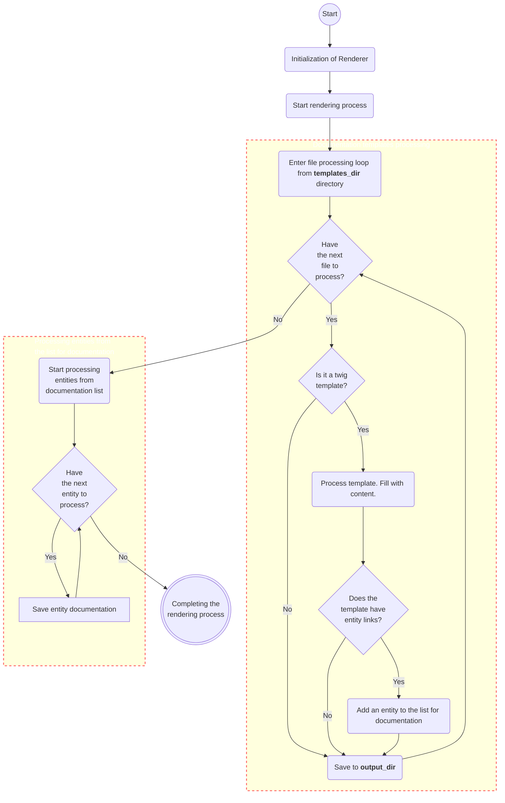

<embed> <a href="/docs/README.md">BumbleDocGen</a> <b>/</b> <a href="/docs/tech/readme.md">Technical description of the project</a> <b>/</b> Renderer<hr> </embed>

<embed> <h1>Documentation renderer</h1> </embed>

Render passes through all files from the directory specified in configuration param `templates_dir`

If the file ends with **.twig** then the file is processed, otherwise it is simply copied
to the target directory obtained from configuration param `output_dir`.
We use twig to process templates.

<embed> <h2>More detailed description of renderer components</h2> </embed>

<embed> <ul><li><div><a href='/docs/tech/3.renderer/01_templates.md'>How to create documentation templates?</a></div></li><li><div><a href='/docs/tech/3.renderer/02_breadcrumbs.md'>Documentation structure and breadcrumbs</a></div></li><li><div><a href='/docs/tech/3.renderer/03_documentStructure.md'>Document structure of generated entities</a></div></li><li><div><a href='/docs/tech/3.renderer/04_twigCustomFilters.md'>Template filters</a></div></li><li><div><a href='/docs/tech/3.renderer/05_twigCustomFunctions.md'>Template functions</a></div></li></ul> </embed>

<embed> <h2>Starting the rendering process</h2> </embed>

```php
 $renderer = new Renderer(...);
 
 // Starting the process of filling templates with data and saving finished documents
 $renderer->run();
```


<embed> <h2>How it works</h2> </embed>

The process of rendering documents is divided into several stages. We separately generate documentation for templates that were pre-prepared by the user,
and then create documentation for classes that the user refers to from document templates.
This process is presented in the form of a diagram below.



<div id='page_committer_info'>
<hr>
<b>Last page committer:</b> fshcherbanich &lt;filipp.shcherbanich@team.bumble.com&gt;<br><b>Last modified date:</b>   Sat Sep 2 21:01:47 2023 +0300<br><b>Page content update date:</b> Tue Dec 19 2023<br>Made with <a href='https://github.com/bumble-tech/bumble-doc-gen/blob/master/docs/README.md'>Bumble Documentation Generator</a></div>