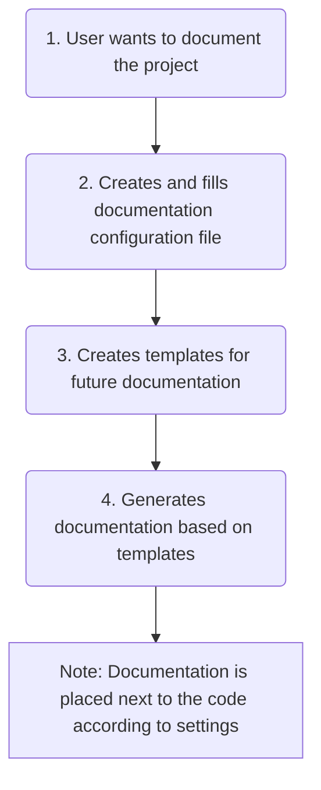

<embed> <a href="/docs/readme.md">BumbleDocGen</a> <b>/</b> Technical description of the project<hr> </embed>

<embed> <h1>Technical description of the project</h1> </embed>

This documentation generator is a library that allows you to create handwritten documentation with dynamic blocks that are loaded from the project code or other places.

<embed> <h2>Documentation sections</h2> </embed>

<embed> <ul><li><div><a href='/docs/tech/1.configuration/readme.md'>Configuration files</a></div></li><li><div><a href='/docs/tech/2.parser/readme.md'>Parser</a></div></li><li><div><a href='/docs/tech/3.renderer/readme.md'>Renderer</a></div></li><li><div><a href='/docs/tech/4.pluginSystem/readme.md'>Plugin system</a></div></li><li><div><a href='/docs/tech/map.md'>Class map</a></div></li></ul> </embed>

<embed> <h2>How it works</h2> </embed>



To start the documentation generation process, you need to call the following command:

```php
 (new DocGeneratorFactory())->create($configFile)->generate()
```


After that, the process of parsing the project code according to the configuration will start, and then filling the templates with data and saving the finished result as final documents.


<div id='page_committer_info'>
<hr>
<b>Last page committer:</b> fshcherbanich &lt;filipp.shcherbanich@team.bumble.com&gt;<br><b>Last modified date:</b>   Sat Sep 2 21:01:47 2023 +0300<br><b>Page content update date:</b> Sun Sep 10 2023<br>Made with <a href='https://github.com/bumble-tech/bumble-doc-gen/blob/master/docs/readme.md'>Bumble Documentation Generator</div>