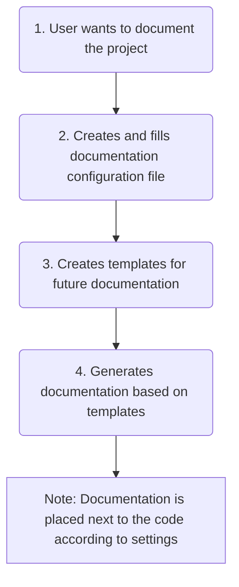

<embed> <a href="/docs/README.md">BumbleDocGen</a> <b>/</b> Technical description of the project<hr> </embed>

<embed> <h1>Technical description of the project</h1> </embed>

This documentation generator is a library that allows you to create handwritten documentation with dynamic blocks that are loaded from the project code or other places.

<embed> <h2>Documentation sections</h2> </embed>

<embed> <ul><li><div><a href='/docs/tech/01_configuration.md'>Configuration</a></div></li><li><div><a href='/docs/tech/02_parser/readme.md'>Parser</a></div></li><li><div><a href='/docs/tech/03_renderer/readme.md'>Renderer</a></div></li><li><div><a href='/docs/tech/04_pluginSystem.md'>Plugin system</a></div></li><li><div><a href='/docs/tech/05_console.md'>Console app</a></div></li><li><div><a href='/docs/tech/06_debugging.md'>Debug documents</a></div></li><li><div><a href='/docs/tech/07_outputFormat.md'>Output formats</a></div></li></ul> </embed>

<embed> <h2>How it works</h2> </embed>



To start the documentation generation process, you need to call the following command:

```php
 (new DocGeneratorFactory())->create($configFile)->generate()
```


or

```php
 (new DocGeneratorFactory())->createByConfigArray($configArray)->generate()
```


After that, the process of parsing the project code according to the configuration will start, and then filling the templates with data and saving the finished result as final documents.


<div id='page_committer_info'>
<hr>
<b>Last page committer:</b> fshcherbanich &lt;filipp.shcherbanich@team.bumble.com&gt;<br><b>Last modified date:</b>   Sat Dec 23 23:00:37 2023 +0300<br><b>Page content update date:</b> Fri Jan 12 2024<br>Made with <a href='https://github.com/bumble-tech/bumble-doc-gen/blob/master/docs/README.md'>Bumble Documentation Generator</a></div>