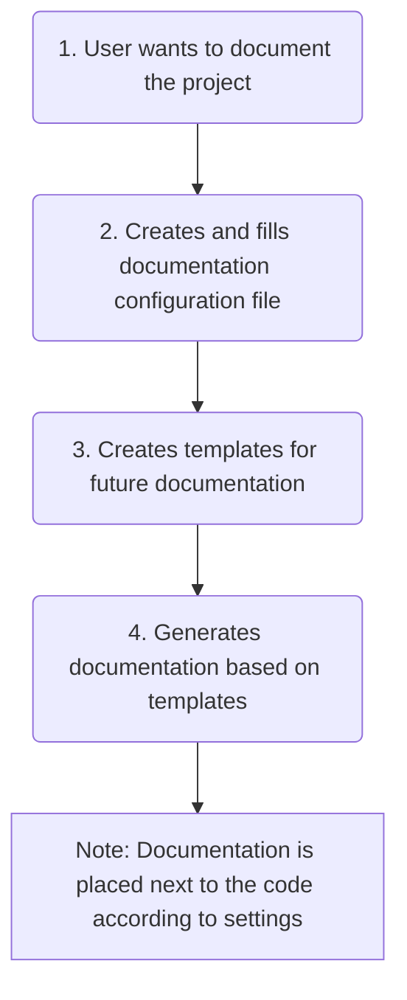

[BumbleDocGen](../README.md) **/**
Technical description of the project

---


# Technical description of the project

This documentation generator is a library that allows you to create handwritten documentation with dynamic blocks that are loaded from the project code or other places.

## Documentation sections


- [Configuration](01_configuration.md)
- [Parser](02_parser/readme.md)
- [Renderer](03_renderer/readme.md)
- [Plugin system](04_pluginSystem.md)
- [Console app](05_console.md)
- [Debug documents](06_debugging.md)
- [Output formats](07_outputFormat.md)

## How it works



To start the documentation generation process, you need to call the following command:

```php
(new DocGeneratorFactory())->create($configFile)->generate();
```

or

```php
(new DocGeneratorFactory())->createByConfigArray($configArray)->generate();
```

After that, the process of parsing the project code according to the configuration will start, and then filling the templates with data and saving the finished result as final documents.


---

**Last page committer:** fshcherbanich &lt;filipp.shcherbanich@team.bumble.com&gt;<br>**Last modified date:**   Sat Jan 20 00:42:48 2024 +0300<br>**Page content update date:** Fri Jan 19 2024<br>Made with [Bumble Documentation Generator](https://github.com/bumble-tech/bumble-doc-gen/blob/master/docs/README.md)